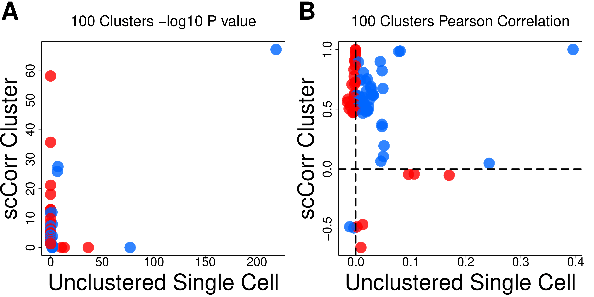
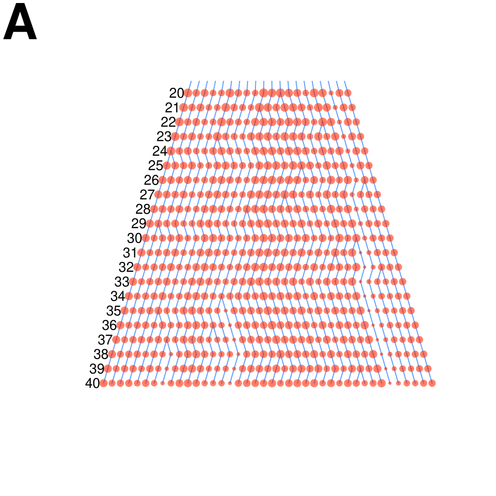
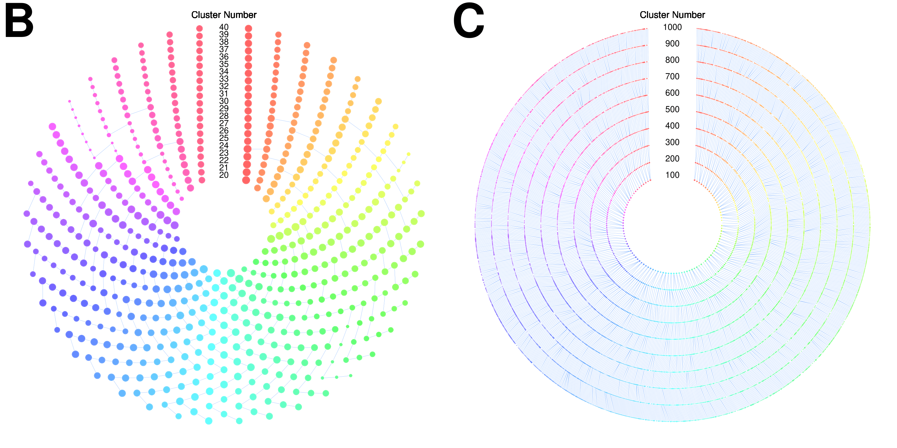
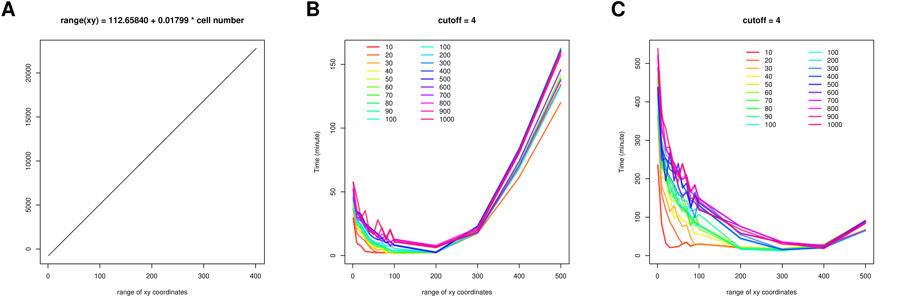

scCorr: R package for single cell association or correlation analysis
=====================================================================

### 1. Installation

    library('devtools')
    install_github("CBIIT-CGBB/scCorr")

### 2. Motivation
One of the challenges in single cell RNA-sequence analysis is abundance of zero values that results in biased estimation of gene-gene correlations for downstream analyses. Here, we present a novel graph-based k-partitioning method by merging “homology” cells to reduce the zero values. The method is robust and reliable for the detection of correlated gene pairs that is fundamental for network construction, gene-gene interaction, and cellular -omic analyses. the associated manuscript "scCorr: A graph-based k-partitioning approach for single-cell gene-gene correlation analysis" was at the [link](https://www.biorxiv.org/content/early/2017/11/14/219188.figures-only).   

<h4 align="center">
Data analysis workflow
</h4>

  

The example R codes are: [tsne](examples/test01_do_tsne.R), [k-partitioning](examples/test02_do_GCluster.R), [merging clusters](examples/test03_merge_clusters.R), [cluster ID renaming](examples/test04_rename_clusterID.R), [correlation analysis](examples/test05_do_corr.R). More examples are at [the end](https://github.com/CBIIT-CGBB/scCorr/blob/master/README.md#14-examples-of-the-functions-of-the-package) of this page and named as **R codes** (please download [**data**](data) for them) in each section.

### 3. Data and the zero count distributions

  

[R codes](examples/01_ABCD.R)

[R codes](examples/01_EFG.R)

A total of 21,430 genes have zero values in at least one cell (A) and more than 95% of
15,973 cells show zero values in at least one cell (B).Among a set of 347 genes from KEGG, all genes
have zero value in at least one cell (C) and 95% of 15,973 cells contains zero value in at least one gene
(D).

E-G shows reductions of zero values in merged cells. The percentage of zero values of 21,430
genes is remarkably reduced in the merged cells. The reduction of zero value is approximately 50%
among 50 merged cells (E). Similarly, zero values of 347 genes selected from KEGG are reduced in
merged cells (F). The reduction of zero values in merged cells is consistently observed in 6 different
number of cell sets (G).

### 4. Graphical based k-partitioning approach

[R codes](examples/01_HIJK.R)

H-L present the workflow and features of scCorr method. First, data dimensional
reduction and cell classification by tSNE and cell type identification using marker gene approach (H).
Secondly, cell partitioning based on tSNE plot by using scCorr with different number of clusters (I: k=100;
J: k=1,000). Average number of cells per cluster is shown (K).

### 5. Cluster tree visualization

[R codes](examples/01_L.R) and one full example (from clustering to tree plotting [R codes](test/13test_cluster_tree.R))  

ScCorr enables to trace evolutional process of each petitioned cluster (L).

### 6. Correlation method comparison

[R codes](examples/02_AB.R) &nbsp;&nbsp;&nbsp;&nbsp;&nbsp;&nbsp;&nbsp;&nbsp;&nbsp;&nbsp;&nbsp;&nbsp;&nbsp;&nbsp;&nbsp;&nbsp;&nbsp;&nbsp;&nbsp;&nbsp;&nbsp;&nbsp;&nbsp;&nbsp;&nbsp;&nbsp;&nbsp;&nbsp;&nbsp;&nbsp;&nbsp;&nbsp;&nbsp;&nbsp;&nbsp;&nbsp;&nbsp;&nbsp;&nbsp;&nbsp;&nbsp;&nbsp;&nbsp;&nbsp;&nbsp;&nbsp;&nbsp;&nbsp;&nbsp;&nbsp;&nbsp;&nbsp;&nbsp;&nbsp;&nbsp;&nbsp;&nbsp;&nbsp;&nbsp;&nbsp;&nbsp;&nbsp;&nbsp;&nbsp;&nbsp;&nbsp;&nbsp;&nbsp;&nbsp;&nbsp;&nbsp;&nbsp;&nbsp;[R codes](examples/02_CD.R)

Correlated genes are
shown in –log10 p values (A) and r value (B). Gene-gene correlations between two methods are in the
same direction in some cases (C) while gene-gene correlations are in opposite direction between two
methods in other cases (D).
### 7. The correlation method validation

[R codes](examples/02_EF.R)
&nbsp;&nbsp;&nbsp;&nbsp;&nbsp;&nbsp;&nbsp;&nbsp;&nbsp;&nbsp;&nbsp;&nbsp;&nbsp;&nbsp;&nbsp;&nbsp;&nbsp;&nbsp;&nbsp;&nbsp;&nbsp;&nbsp;&nbsp;&nbsp;&nbsp;&nbsp;&nbsp;&nbsp;&nbsp;&nbsp;&nbsp;&nbsp;&nbsp;&nbsp;&nbsp;&nbsp;&nbsp;&nbsp;&nbsp;&nbsp;&nbsp;&nbsp;&nbsp;&nbsp;&nbsp;&nbsp;&nbsp;&nbsp;&nbsp;&nbsp;&nbsp;&nbsp;&nbsp;&nbsp;&nbsp;&nbsp;&nbsp;&nbsp;&nbsp;&nbsp;&nbsp;&nbsp;&nbsp;&nbsp;&nbsp;&nbsp;&nbsp;&nbsp;&nbsp;&nbsp;&nbsp;&nbsp;&nbsp;[R codes](examples/02_GH.R)

E and F show top 10 correlated genes in different number of clusters partitioned by scCorr among CD4 T cells
evaluated by –log 10 p value (E) and r value (F). Performances of scCorr for cell type identification of CD4 T cells
are shown in G (k=117) and H (k=10). Area Under Curve (AUC) was greater by using scCorr (AUC: 0.97
and 0.96) than using unflustered single cell (AUC=0.55).

### 8. Distributions of zero value of gene expressions

[R codes](examples/supp1_AB.R)
&nbsp;&nbsp;&nbsp;&nbsp;&nbsp;&nbsp;&nbsp;&nbsp;&nbsp;&nbsp;&nbsp;&nbsp;&nbsp;&nbsp;&nbsp;&nbsp;&nbsp;&nbsp;&nbsp;&nbsp;&nbsp;&nbsp;&nbsp;&nbsp;&nbsp;&nbsp;&nbsp;&nbsp;&nbsp;&nbsp;&nbsp;&nbsp;&nbsp;&nbsp;&nbsp;&nbsp;&nbsp;&nbsp;&nbsp;&nbsp;&nbsp;&nbsp;&nbsp;&nbsp;&nbsp;&nbsp;&nbsp;&nbsp;&nbsp;&nbsp;&nbsp;&nbsp;&nbsp;&nbsp;&nbsp;&nbsp;&nbsp;&nbsp;&nbsp;&nbsp;&nbsp;&nbsp;&nbsp;&nbsp;&nbsp;&nbsp;&nbsp;&nbsp;&nbsp;&nbsp;&nbsp;&nbsp;&nbsp;

Distributions of zero value expressions in four sets of simulated datasets (A) and in the scRNA-seq dataset with 21,430 genes
, 15973 cells (B).

### 9. More t-SNE plot-based k-partitioning cluster examples

[R codes](examples/supp2_AB.R)
&nbsp;&nbsp;&nbsp;&nbsp;&nbsp;&nbsp;&nbsp;&nbsp;&nbsp;&nbsp;&nbsp;&nbsp;&nbsp;&nbsp;&nbsp;&nbsp;&nbsp;&nbsp;&nbsp;&nbsp;&nbsp;&nbsp;&nbsp;&nbsp;&nbsp;&nbsp;&nbsp;&nbsp;&nbsp;&nbsp;&nbsp;&nbsp;&nbsp;&nbsp;&nbsp;&nbsp;&nbsp;&nbsp;&nbsp;&nbsp;&nbsp;&nbsp;&nbsp;&nbsp;&nbsp;&nbsp;&nbsp;&nbsp;&nbsp;&nbsp;&nbsp;&nbsp;&nbsp;&nbsp;&nbsp;&nbsp;&nbsp;&nbsp;&nbsp;&nbsp;&nbsp;&nbsp;&nbsp;&nbsp;&nbsp;&nbsp;&nbsp;&nbsp;&nbsp;&nbsp;&nbsp;&nbsp;&nbsp;

t-SNE plot-based k-partitioning cluster. All cells are clustered as 50, 100, and 1,000 groups (A).
The same clusters are shown in dot-plot views (B), where each dot represents a cluster and the size is
proportional to the cluster size.  

### 10. Tree-based visualization of cell clusters  

[R codes](examples/supp3_A.R)
&nbsp;&nbsp;&nbsp;&nbsp;&nbsp;&nbsp;&nbsp;&nbsp;&nbsp;&nbsp;&nbsp;&nbsp;&nbsp;&nbsp;&nbsp;&nbsp;&nbsp;&nbsp;&nbsp;&nbsp;&nbsp;&nbsp;&nbsp;&nbsp;&nbsp;&nbsp;&nbsp;&nbsp;&nbsp;&nbsp;&nbsp;&nbsp;&nbsp;&nbsp;&nbsp;&nbsp;&nbsp;&nbsp;&nbsp;&nbsp;&nbsp;&nbsp;&nbsp;&nbsp;&nbsp;&nbsp;&nbsp;&nbsp;&nbsp;&nbsp;&nbsp;&nbsp;&nbsp;&nbsp;&nbsp;&nbsp;&nbsp;&nbsp;&nbsp;&nbsp;&nbsp;&nbsp;&nbsp;&nbsp;&nbsp;&nbsp;&nbsp;&nbsp;&nbsp;&nbsp;&nbsp;&nbsp;&nbsp;[R codes](examples/supp3_BC.R)

Tree-based visualization of cell clusters by k-partitioning algorithm (A: Ladder clusters N=20-40; B: Circle clusters
N=20-40; C: circle clusters, N=100-1,000). The size of each dot size represents a proportional of the cell number in one cluster.
A line connects two closest clusters.  

### 11. Correlation by non-clusterd method and by scCorr clustered method

[R codes](examples/supp4_ABCD.R)
&nbsp;&nbsp;&nbsp;&nbsp;&nbsp;&nbsp;&nbsp;&nbsp;&nbsp;&nbsp;&nbsp;&nbsp;&nbsp;&nbsp;&nbsp;&nbsp;&nbsp;&nbsp;&nbsp;&nbsp;&nbsp;&nbsp;&nbsp;&nbsp;&nbsp;&nbsp;&nbsp;&nbsp;&nbsp;&nbsp;&nbsp;&nbsp;&nbsp;&nbsp;&nbsp;&nbsp;&nbsp;&nbsp;&nbsp;&nbsp;&nbsp;&nbsp;&nbsp;&nbsp;&nbsp;&nbsp;&nbsp;&nbsp;&nbsp;&nbsp;&nbsp;&nbsp;&nbsp;&nbsp;&nbsp;&nbsp;&nbsp;&nbsp;&nbsp;&nbsp;&nbsp;&nbsp;&nbsp;&nbsp;&nbsp;&nbsp;&nbsp;&nbsp;&nbsp;&nbsp;&nbsp;&nbsp;&nbsp;

Correlation of two co-expression gene pairs: MAPK1 pair and DUSP2 pairs by non-clustered
Correlation method (A) and by sscCorr clustered method (B).

### 12. Correlation of top 10 co-expressed gene pairs in different number of partitioned clusters

[R codes](examples/supp5_A.R)
&nbsp;&nbsp;&nbsp;&nbsp;&nbsp;&nbsp;&nbsp;&nbsp;&nbsp;&nbsp;&nbsp;&nbsp;&nbsp;&nbsp;&nbsp;&nbsp;&nbsp;&nbsp;&nbsp;&nbsp;&nbsp;&nbsp;&nbsp;&nbsp;&nbsp;&nbsp;&nbsp;&nbsp;&nbsp;&nbsp;&nbsp;&nbsp;&nbsp;&nbsp;&nbsp;&nbsp;&nbsp;&nbsp;&nbsp;&nbsp;&nbsp;&nbsp;&nbsp;&nbsp;&nbsp;&nbsp;&nbsp;&nbsp;&nbsp;&nbsp;&nbsp;&nbsp;&nbsp;&nbsp;&nbsp;&nbsp;&nbsp;&nbsp;&nbsp;&nbsp;&nbsp;&nbsp;&nbsp;&nbsp;&nbsp;&nbsp;&nbsp;&nbsp;&nbsp;&nbsp;&nbsp;&nbsp;&nbsp;

Correlation of top 10 co-expressed gene pairs from cluster 40 in different number of partitioned clusters: evaluated by p values and correlation coefficient values. In the title, n#, the numbers are the thresholds for the cluster merging. If one cluster cell number less than the threshold, the cluster will be merged into the adjacent cluster.

### 13. Estimation of Computation Time

[R codes](examples/supp6_A.R)
&nbsp;&nbsp;&nbsp;&nbsp;&nbsp;&nbsp;&nbsp;&nbsp;&nbsp;&nbsp;&nbsp;&nbsp;&nbsp;&nbsp;&nbsp;&nbsp;&nbsp;&nbsp;&nbsp;&nbsp;&nbsp;&nbsp;&nbsp;&nbsp;&nbsp;&nbsp;&nbsp;&nbsp;&nbsp;&nbsp;&nbsp;&nbsp;&nbsp;&nbsp;&nbsp;&nbsp;&nbsp;&nbsp;&nbsp;&nbsp;&nbsp;&nbsp;&nbsp;&nbsp;&nbsp;&nbsp;&nbsp;&nbsp;&nbsp;&nbsp;&nbsp;&nbsp;&nbsp;&nbsp;&nbsp;&nbsp;&nbsp;&nbsp;&nbsp;&nbsp;&nbsp;&nbsp;&nbsp;&nbsp;&nbsp;&nbsp;&nbsp;&nbsp;&nbsp;&nbsp;&nbsp;&nbsp;&nbsp;

The xy.coordinate is the regions for scaling. For example, xy.coordinate is 50, the scaling region will be from -50 to 50, and so on.  We suggest that the xy.coordinates are 300 or 400 for about single cells from 5,000 to 15,000. The xy.coordinates could  be the increased if you have more single cells.

### 14. Examples of the functions of the package

[c_list](test/01test_c_list.R) : A graph-based k-partitioning method with scaling

[d_list](test/02test_d_list.R) : Merging homological single cells by one coordinate with density method

[GCluster](test/03test_GCluster.R) : Graphical based clustering

[get_value](test/04test_get_value.R) : Converting single cell based matrix to cluster based matrix

[m_list](test/05test_m_list.R) : Merging homological single cells by one coordinate by window sizes

[merge_list](test/06test_merge_list.R) : Merging cluster into adjacent cluster if the merged cluster single
  cell number less than one cutoff

[mgGCLuster](test/07test_mgGCLuster.R) : Merging clusters given the merged cluster IDs

[scale_v](test/08test_scale_v.R) : Scaling function

[tj_list](test/09test_tj_list.R) : Merging homological single cells by trajectory analysis

[tjGCluster](test/10test_tjGCluster.R) : Trajectory analysis function for [tj_list](test/09test_tj_list.R)

[tjGCluster2](test/11test_tjGCluster2.R) : Trajectory analysis function II for [tj_list](test/09test_tj_list.R)

[r_c](test/12test_rotate_coordinate.R) : Rotating coordinate
