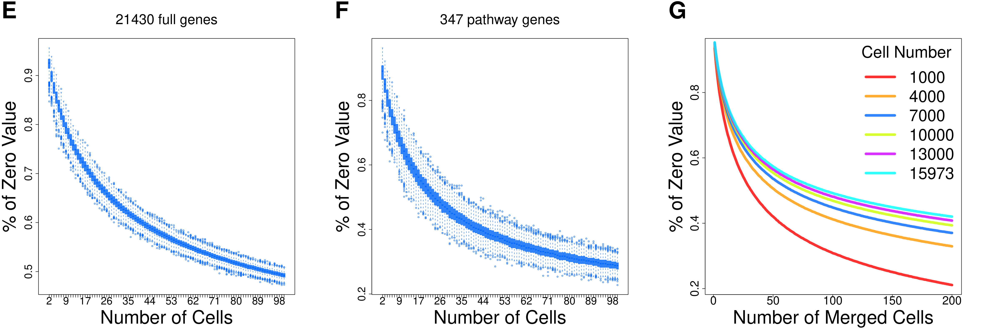

scCorr: R package for single cell association or correlation analysis
=====================================================================

### 1. Installaling

    library('devtools')
    install_github("CBIIT-CGBB/scCorr",auth_token = 'cbd6dad89a1f8c12c8cb54bfca9c3027796835ea')

### 2. Motivation
One of the challenges in single cell RNA-sequence analysis is abundance of zero values that results in biased estimation of gene-gene correlations for downstream analyses. Here, we present a novel graph-based k-partitioning method by merging “homology” cells to reduce the zero values. The method is robust and reliable for the detection of correlated gene pairs that is fundamental for network construction, gene-gene interaction, and cellular -omic analyses.   
### 3. Data and the zero count distributions

  

[R codes](examples/01_ABCD.R)

[R codes](examples/01_EFG.R)

### 4. Graphical based k-partitioning approach 

[R codes](examples/01_HIJK.R)

### 5. Cluster tree visualization 

[R codes](examples/01_I.R)

[R codes](examples/02_AB.R) &nbsp;&nbsp;&nbsp;&nbsp;&nbsp;&nbsp;&nbsp;&nbsp;&nbsp;&nbsp;&nbsp;&nbsp;&nbsp;&nbsp;&nbsp;&nbsp;&nbsp;&nbsp;&nbsp;&nbsp;&nbsp;&nbsp;&nbsp;&nbsp;&nbsp;&nbsp;&nbsp;&nbsp;&nbsp;&nbsp;&nbsp;&nbsp;&nbsp;&nbsp;&nbsp;&nbsp;&nbsp;&nbsp;&nbsp;&nbsp;&nbsp;&nbsp;&nbsp;&nbsp;&nbsp;&nbsp;&nbsp;&nbsp;&nbsp;&nbsp;&nbsp;&nbsp;&nbsp;&nbsp;&nbsp;&nbsp;&nbsp;&nbsp;&nbsp;&nbsp;&nbsp;&nbsp;&nbsp;&nbsp;&nbsp;&nbsp;&nbsp;&nbsp;&nbsp;&nbsp;&nbsp;&nbsp;&nbsp;[R codes](examples/02_CD.R)

[R codes](examples/02_EF.R)
&nbsp;&nbsp;&nbsp;&nbsp;&nbsp;&nbsp;&nbsp;&nbsp;&nbsp;&nbsp;&nbsp;&nbsp;&nbsp;&nbsp;&nbsp;&nbsp;&nbsp;&nbsp;&nbsp;&nbsp;&nbsp;&nbsp;&nbsp;&nbsp;&nbsp;&nbsp;&nbsp;&nbsp;&nbsp;&nbsp;&nbsp;&nbsp;&nbsp;&nbsp;&nbsp;&nbsp;&nbsp;&nbsp;&nbsp;&nbsp;&nbsp;&nbsp;&nbsp;&nbsp;&nbsp;&nbsp;&nbsp;&nbsp;&nbsp;&nbsp;&nbsp;&nbsp;&nbsp;&nbsp;&nbsp;&nbsp;&nbsp;&nbsp;&nbsp;&nbsp;&nbsp;&nbsp;&nbsp;&nbsp;&nbsp;&nbsp;&nbsp;&nbsp;&nbsp;&nbsp;&nbsp;&nbsp;&nbsp;[R codes](examples/02_GH.R)
