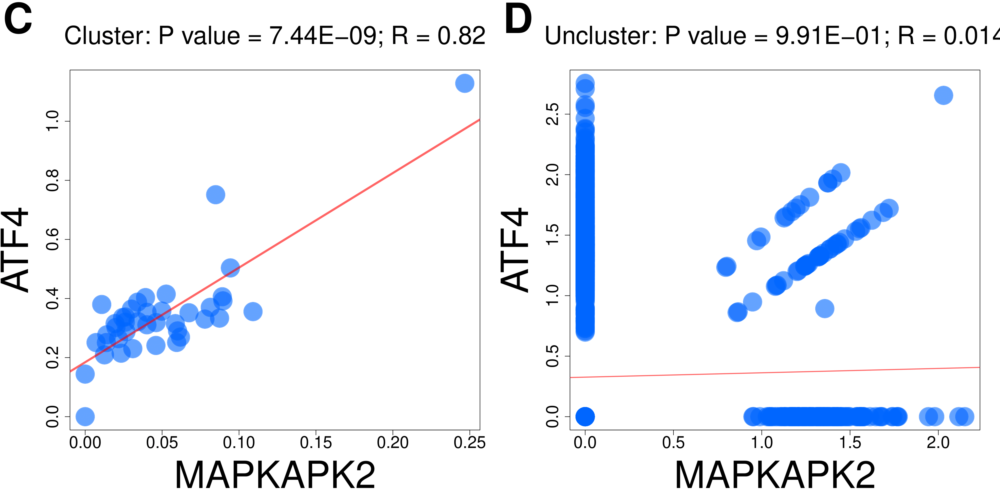

scCorr: R package for single cell association or correlation analysis
=====================================================================

### 1.Installaling

    library('devtools')
    install_github("CBIIT-CGBB/scCorr",auth_token = 'cbd6dad89a1f8c12c8cb54bfca9c3027796835ea')

### 2. Plots
  

